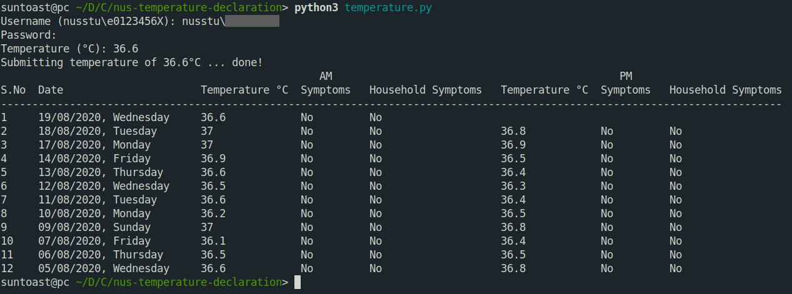

# nus-temperature-declaration

A quick little python script I wrote this morning to help with my temperature declaration at NUS.



## Usage

The python package `beautifulsoup4` needs to be installed beforehand; you can install it using `pip3 install beautifulsoup4`.

Run the script to declare your temperature as follows:

```sh
$ python3 temperature.py
```

Note: with a few additional steps, this can be modified to automate the temperature declaration process entirely using cron jobs. Please don't do that! It kind of defeats the purpose of temperature declarations in the first place.
