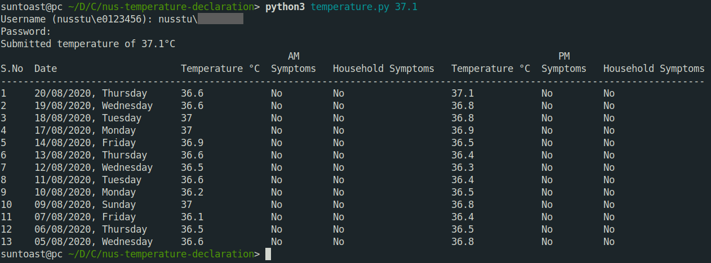

# nus-temperature-declaration

A quick little python script I wrote to help with my temperature declaration at NUS.

## Usage

The python package `beautifulsoup4` needs to be installed beforehand; you can install it using `pip3 install beautifulsoup4`.

To declare your temperature, run `python3 temperature.py <temperature>`.

To check your temperature, run `python3 temperature.py -c`.

## Setup (optional)

If you don't want to enter your username and password every time, you can store it in a text file.

Copy `config-example.txt` to `config.txt`, replacing the username and password fields accordingly.

## The Dark Side

If you wish to automate your temperature declarations for whatever reason, you can put `auto.sh` in your crontab.

It acts a failsafe: if you haven't declared your temperature by then, it declares a random one for you. But of course, if you're a good person and already declare your temperature regularly, it will have no effect.

This requires that you input your username and password in `config.txt` beforehand.

[Disclaimer: not saying that I do this, or that I recommend you to do this! It was just a fun little thing to do.]
